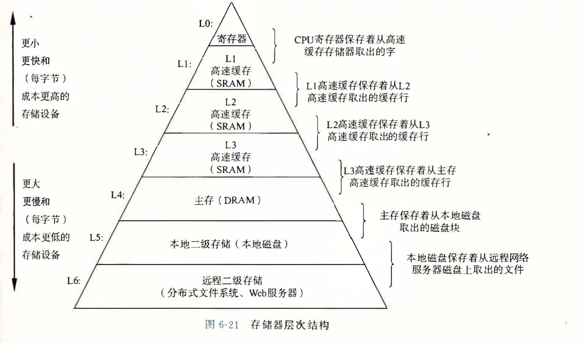

# MySQL 
MySQL 数据库是一款关系型数据库。目前中小型企业，甚至大型企业都在使用。

## 关系型数据库的定义：
关系型数据库是信息的集合，它以预定义的关系组织数据，数据存储在一个或多个由列和行构成的表（或“关系”）中，用户可以轻松查看和理解不同数据结
构之间的关系。关系是不同表之间的逻辑连接，根据这些表之间的交互建立。

典型的代表有：SQL Server，Oracle,Mysql,PostgreSQL。

### 关系型数据库优点：
1. 容易理解，二维表的结构非常贴近现实世界，二维表格，容易理解。 
2. 使用方便，通用的sql语句使得操作关系型数据库非常方便。 
3. 易于维护，数据库的ACID属性，大大降低了数据冗余和数据不一致的概率。
### ACID
原子性（atomicity，或称不可分割性）、一致性（consistency）、隔离性（isolation，又称独立性）、持久性（durability）

### 关系型数据库缺点：
1. 海量数据的读写效率: 对于网站的并发量高，往往达到每秒上万次的请求，对于传统关系型数据库来说，硬盘I/o是一个很大的挑战。
2. 高扩展性和可用性: 在基于web的结构中，数据库是最难以横向拓展的，当一个应用系统的用户量和访问量与日俱增的时候，数据库没有办法像
web Server那样简单的通过添加更多的硬件和服务节点来拓展性能和负载能力

## 非关系型数据库
非关系数据库不以表格式存储和组织数据。不同数据点之间没有表、行、列或关系。 相反，数据存储在集合中。数据库通常是非结构化的并使用动态架构。

典型的代表有：MongoDB，Redis、CouchDB；

### 非关系型数据库优点
1. 无需经过sql层的解析，读写性能很高； 
2. 基于键值对，数据没有耦合性，容易扩展； 
3. 存储数据的格式：nosql的存储格式是key,value形式、文档形式、图片形式等等，文档形式、图片形式等等，而关系型数据库则只支持基础类型。

### 非关系型数据库缺点
1. 不提供sql支持，学习和使用成本较高； 
2. 无事务处理，附加功能bi和报表等支持也不好；

# MySQL 索引
索引的定义：索引是帮助 MySQL 高效获取数据的排好序的数据结构

常见的索引数据结构：
1. 二叉树：
2. 红黑树：
3. Hash 表：
4. B-Tree

在了解索引之前，首先我们需要了解在计算机中数据是怎么存储的。

## 计算机的存储结构
1. 寄存器和cpu速度相当，空间比较小在kb级别。      
2. 高速缓存比寄存器要慢1倍左右，但是空间可以达到MB级别。
3. 内存比缓存要慢10倍左右，但是空间可以达到GB级别，当前个人电脑一般都不小于4G
4. 硬盘这个速度更慢，比内存要慢上万被，千万被级别，但是价格也比较偏移，空间也很大。
5. 其他存储光盘，软盘，usb外接的其他存储器，作为硬盘的一个补充，有便于携带的优点

类似一个金字塔结构：

## 磁盘存储原理
磁盘是计算机存储系统、数据、文件等信息的硬件。磁盘主要由碟片、磁头、电机马达、接口和控制电路控制芯片组成。
主要了解一下：磁头，磁道，扇区，柱面 概念即可。

1. 磁头（head）：不用说，主要就是读取磁盘表面磁方向和改变其方向，每个盘面有一个磁头，它极其贴近地悬浮在盘面上，但是绝对不与盘面接触，否则会损坏磁头和盘面；
2. 磁道（track）：磁道是单个盘面上的同心圆，当磁盘旋转时，磁头若保持在一个位置上，则每个磁头都会在磁盘表面划出一个圆形轨迹，这些圆形轨迹就叫做磁道，
一个盘面上的磁道可以有成千上万个。相邻磁道之间并不是紧挨着的，这是因为磁化单元相隔太近时磁性会产生相互影响，同时也为磁头的读写带来困难。
3. 柱面（cylinder）：在由多个盘片构成的盘组中，由不同盘片的面，但处于同一半径圆的多个磁道组成的一个圆柱面。
4. 扇区（sector）：磁盘上的每个磁道被等分为若干个弧段，这些弧段便是硬盘的扇区（Sector）。硬盘的第一个扇区，叫做引导扇区。扇区是被间隙
（gap）分割的圆的片段，间隙未被磁化成0或者1。注意，扇区是读写磁盘最基本的单位，如果一个扇区因为某种原因被破坏，那么整个扇区的数据都会受影响。

由上面的定义我们可以知道，数据的存放最终是存放在了扇区中，因此，数据的存放在磁盘上可能并不连续。因此，在操作系统从磁盘上读取数据时，会经历如
下步骤：
1. 当需要从磁盘读取数据时，系统会将数据逻辑地址传给磁盘，磁盘的控制电路按照寻址逻辑将逻辑地址翻译成物理地址，即确定要读的数据在哪个磁道，哪个扇区;
2. 为了读取这个扇区的数据，需要将磁头放到这个扇区上方: 
   1. 首先必须找到柱面，即磁头需要移动对准相应磁道，这个过程叫做寻道或定位；
   2. 盘面确定以后，盘片开始旋转，将目标扇区旋转到磁头下;

总结一下就是：
即一次访盘请求（读/写）完成过程由三个动作组成：
1. 寻道（时间）：磁头移动定位到指定磁道，这部分时间代价最高，最大可达到0.1s左右； 
2. 旋转延迟（时间）：等待指定扇区旋转至磁头下。与硬盘自身性能有关，xxxx转/分； 
3. 数据传输（时间）：数据通过系统总线从磁盘传送到内存的时间，一般传输一个字节大概0.02us。

通常我们将这个(读/写)过程称之为对磁盘的一次 I/O 操作。为了减少 I/O 次数，提高查询效率，因此引入了**索引**。

举个例子，想象一下，现在有一本500页厚包含几十万字的字典，同时里面的字是无序排列的，现在我需要你从中找出某几个字出来同时不允许查看目录。毫无疑问，我们只能一页一页的翻，这是非人类能接受的工作，我们必然想的是先看目录，找到相关的字或者偏旁，然后去对应的地方查找文字，这样效率就大大提高了。目录事实上就是一种索引，其思想一脉相承。
数据库的索引类似于书中的这个目录。索引会帮助我们快速检索数据库，查询不需要通过整个表来获取数据，而是从索引中找到数据块。

## 例子
先说一下 MySQL 底层数据结构并没有使用前面提到过的几种数据结构。我们通过下面这个例子分析一下：如图：

