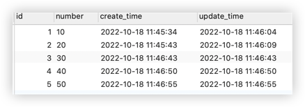
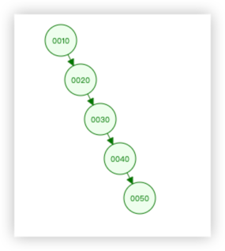
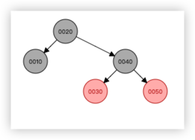
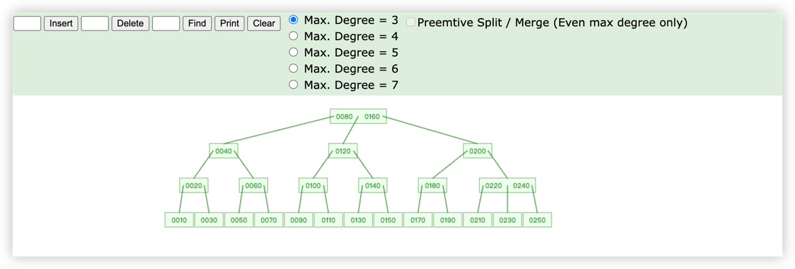
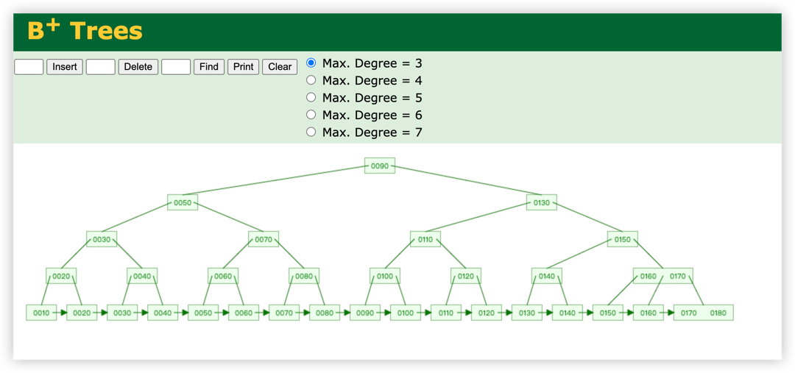
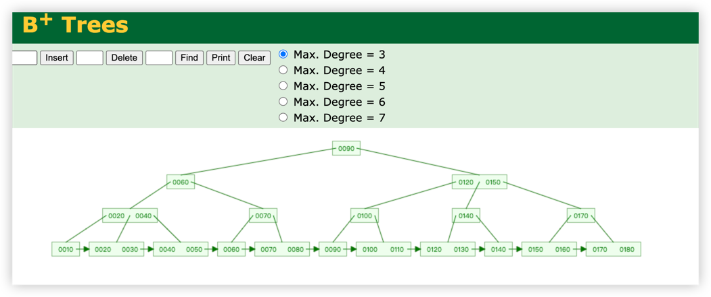

# MySQL 概述
MySQL 数据库是一款关系型数据库。目前中小型企业，甚至大型企业都在使用。

## 关系型数据库的定义：
关系型数据库是信息的集合，它以预定义的关系组织数据，数据存储在一个或多个由列和行构成的表（或“关系”）中，用户可以轻松查看和理解不同数据结
构之间的关系。关系是不同表之间的逻辑连接，根据这些表之间的交互建立。

典型的代表有：SQL Server，Oracle,Mysql,PostgreSQL。

### 关系型数据库优点：
1. 容易理解，二维表的结构非常贴近现实世界，二维表格，容易理解。 
2. 使用方便，通用的sql语句使得操作关系型数据库非常方便。 
3. 易于维护，数据库的ACID属性，大大降低了数据冗余和数据不一致的概率。
### ACID
原子性（atomicity，或称不可分割性）、一致性（consistency）、隔离性（isolation，又称独立性）、持久性（durability）

### 关系型数据库缺点：
1. 海量数据的读写效率: 对于网站的并发量高，往往达到每秒上万次的请求，对于传统关系型数据库来说，硬盘I/o是一个很大的挑战。
2. 高扩展性和可用性: 在基于web的结构中，数据库是最难以横向拓展的，当一个应用系统的用户量和访问量与日俱增的时候，数据库没有办法像
web Server那样简单的通过添加更多的硬件和服务节点来拓展性能和负载能力

## 非关系型数据库
非关系数据库不以表格式存储和组织数据。不同数据点之间没有表、行、列或关系。 相反，数据存储在集合中。数据库通常是非结构化的并使用动态架构。

典型的代表有：MongoDB，Redis、CouchDB；

### 非关系型数据库优点
1. 无需经过sql层的解析，读写性能很高； 
2. 基于键值对，数据没有耦合性，容易扩展； 
3. 存储数据的格式：nosql的存储格式是key,value形式、文档形式、图片形式等等，文档形式、图片形式等等，而关系型数据库则只支持基础类型。

### 非关系型数据库缺点
1. 不提供sql支持，学习和使用成本较高； 
2. 无事务处理，附加功能bi和报表等支持也不好；

# MySQL 索引
索引的定义：索引是帮助 MySQL 高效获取数据的**排好序**的数据结构

常见的索引数据结构：
1. 二叉树：
2. 红黑树：
3. Hash 表：
4. B-Tree

在了解索引之前，首先我们需要了解在计算机中数据是怎么存储的。

## 计算机的存储结构
1. 寄存器和cpu速度相当，空间比较小在kb级别。      
2. 高速缓存比寄存器要慢1倍左右，但是空间可以达到MB级别。
3. 内存比缓存要慢10倍左右，但是空间可以达到GB级别，当前个人电脑一般都不小于4G
4. 硬盘这个速度更慢，比内存要慢上万被，千万被级别，但是价格也比较偏移，空间也很大。
5. 其他存储光盘，软盘，usb外接的其他存储器，作为硬盘的一个补充，有便于携带的优点

类似一个金字塔结构：

## 磁盘存储原理
磁盘是计算机存储系统、数据、文件等信息的硬件。磁盘主要由碟片、磁头、电机马达、接口和控制电路控制芯片组成。
主要了解一下：磁头，磁道，扇区，柱面 概念即可。

1. 磁头（head）：不用说，主要就是读取磁盘表面磁方向和改变其方向，每个盘面有一个磁头，它极其贴近地悬浮在盘面上，但是绝对不与盘面接触，否则会损坏磁头和盘面；
2. 磁道（track）：磁道是单个盘面上的同心圆，当磁盘旋转时，磁头若保持在一个位置上，则每个磁头都会在磁盘表面划出一个圆形轨迹，这些圆形轨迹就叫做磁道，
一个盘面上的磁道可以有成千上万个。相邻磁道之间并不是紧挨着的，这是因为磁化单元相隔太近时磁性会产生相互影响，同时也为磁头的读写带来困难。
3. 柱面（cylinder）：在由多个盘片构成的盘组中，由不同盘片的面，但处于同一半径圆的多个磁道组成的一个圆柱面。
4. 扇区（sector）：磁盘上的每个磁道被等分为若干个弧段，这些弧段便是硬盘的扇区（Sector）。硬盘的第一个扇区，叫做引导扇区。扇区是被间隙
（gap）分割的圆的片段，间隙未被磁化成0或者1。注意，扇区是读写磁盘最基本的单位，如果一个扇区因为某种原因被破坏，那么整个扇区的数据都会受影响。

由上面的定义我们可以知道，数据的存放最终是存放在了扇区中，因此，数据的存放在磁盘上可能并不连续。因此，在操作系统从磁盘上读取数据时，会经历如
下步骤：
1. 当需要从磁盘读取数据时，系统会将数据逻辑地址传给磁盘，磁盘的控制电路按照寻址逻辑将逻辑地址翻译成物理地址，即确定要读的数据在哪个磁道，哪个扇区;
2. 为了读取这个扇区的数据，需要将磁头放到这个扇区上方: 
   1. 首先必须找到柱面，即磁头需要移动对准相应磁道，这个过程叫做寻道或定位；
   2. 盘面确定以后，盘片开始旋转，将目标扇区旋转到磁头下;

总结一下就是：
即一次访盘请求（读/写）完成过程由三个动作组成：
1. 寻道（时间）：磁头移动定位到指定磁道，这部分时间代价最高，最大可达到0.1s左右； 
2. 旋转延迟（时间）：等待指定扇区旋转至磁头下。与硬盘自身性能有关，xxxx转/分； 
3. 数据传输（时间）：数据通过系统总线从磁盘传送到内存的时间，一般传输一个字节大概0.02us。

通常我们将这个(读/写)过程称之为对磁盘的一次 I/O 操作。为了减少 I/O 次数，提高查询效率，因此引入了**索引**。

举个例子，想象一下，现在有一本500页厚包含几十万字的字典，同时里面的字是无序排列的，现在我需要你从中找出某几个字出来同时不允许查看目录。毫无疑问，我们只能一页一页的翻，这是非人类能接受的工作，我们必然想的是先看目录，找到相关的字或者偏旁，然后去对应的地方查找文字，这样效率就大大提高了。目录事实上就是一种索引，其思想一脉相承。
数据库的索引类似于书中的这个目录。索引会帮助我们快速检索数据库，查询不需要通过整个表来获取数据，而是从索引中找到数据块。

## 例子
先说一下 MySQL 底层数据结构并没有使用前面提到过的几种数据结构。我们通过下面这个例子分析一下：如图：

### 二叉树存储
当我们将上述数据按照二叉树的数据结构存放，看一下是二叉树是如何构建的：

可以发现二叉树成了链式结构，当我们要查找 50 这个数据，会按照类似链遍的形式遍历所有数据，在第 5 次找到我们想要的数据。
这就相当于操作了 5 次 I/O，对于这种单边增长的数据，并没有提升查询效率。
### 红黑树
红黑树的构建图：

相对于二叉树的存储，红黑树具有自平衡的特点：从根到叶子的最长的可能路径不多于最短的可能路径的两倍长，相比于二叉树在查询性能上有了进一步的提升。
但是红黑树仍然有自己的局限性，当数据量很大的情况下，红黑树存放的数据越多，那么必然会导致一个问题，那就是红黑树的高度增加，高度增加就意味着
I/O 次数的增多，查询效率就会下降。红黑树可以在 O(log n) 时间内做查找、插入和删除，这里 n 是树中元素数目。当 n 越大，时间复杂度是呈线性增长的。
### B-Tree (B 树)
根据上述两个数据结构来看，树的结构确实能带来查询性能的优化，但是随着数据量的增加，树的的高度就会增加，进而影响查询效率。所以需要我们一方面
控制树的高度，另一方面要进可能的多存数据。针对于这种特性，B-Tree 的数据结构诞生了。

B树中每一个内部节点会包含一定数量的键，键将节点的子树分开。例如，如果一个内部节点有3个子节点（子树），那么它就必须有两个键： a1 和 a2 。
左边子树的所有值都必须小于 a1 ，中间子树的所有值都必须在 a1 和a2 之间，右边子树的所有值都必须大于 a2 。数据存储结构如下图(额外增加了许多数据)：

但是 MySQL 底层的索引结构仍然没有使用 B-Tree。这是因为在 B-Tree 的叶子节点中除了关键字、指针、还包含除关键字外的其他信息。前面提到过，
数据会存放到磁盘的扇区上，每个扇区的 大小是固定的，当你横向的数据较大，那么就意味这横向存放的数据索引变小，纵向就要变长即树的高度增加，
也就意味查询数据的 I/O 次数增加，导致查询效率下降。可以计算一下：

Innodb 的存储是以 page 为单位，一页大小默认是 16384 个字节即 16 KB。我们一般以主键作为索引，bigint 在MySQl 中占 8 个字节；
指针占 6 个字节，正常情况下，额外的数据记录不会超过 1 KB，所以 16384/1024 等于 16 个叶子节点大小，每个节点代表一条数据记录，那么一个高度
为 2 的 B-Tree 只能存放 16 * 16 = 256 条记录；当存放千万级别的数据的时候，B-Tree 的高度可想而知。

### B+ 树
上面分析了 B-Tree 的缺点之后，我们知道是因为节点存储了额外的信息导致每页可放的节点数变少，即横向变短。那么我们可以将额外的数据信息放到
叶子节点中，非叶子节点只存放关键字、指针信息，这样虽然会造成关键字、索引冗余，但是数据的存放量却大大提升了。如下图是存放了 10～180 的 B+
的数据结构图：

可以看到所有的数据信息都存放到最下面的叶子节点中。且是按照顺序排列。同样按照上述的例子计算：16384/14 = 1170；每页可以存放 1170 个节点；
当 B+ 树的高度为 1 的时候，可以存放 1170 * 16 = 18720，高度为 3， 18720 * 1170 = 21902400 三层可以存放 2 千多万数据。而且只需要三次
I/O。这效率绝对刚刚的。

# 存储引擎
聚簇索引：表数据文件本身就是按 B+Tree 组织的一个索引结构文件；叶子节点包含了完整的数据记录；Innodb 就是使用的聚簇索引
非聚簇索引：叶子节点仍然是索引文件，只是这个索引文件中包含指向对应数据块的指针：MyISAM 存储引擎。数据文件和索引文件分成两个文件

一个面试题：为什么 Innodb 表推荐创建表建立主键并且设置为整形且自增：
1. 建立主键：Innodb表数据文件是由 B+Tree 构成的索引结构文件，主键 id 自带索引，构建表的时候可以直接使用主键 id 进行构建。如果我们不建立主键 id 的话，
Innodb 在构建数据存储文件的时候会挑选一列没有重复的数据作为唯一标识开始构建，如果没有找到这样的数据列，那么 Innodb 会自动创建一个隐藏列
来构建表数据文件。通常来说，数据库这么宝贵的资源，不应该让它去处理这些无意义的逻辑。
2. 设置为整形：其次整形在 Innodb 中占用空间较小，查找比较的时候，整形比 UUID或者字符串比较，效率较高；
3. 自增：涉及到的问题比较多。
4. 为什么非主键索引结构叶子节点存储的是主键值：节省存储空间。因为当一个表里有很多索引的时候，如果每个索引树存储了具体的数据，会导致数据冗余，
造成磁盘空间的浪费。相比于根据索引查找到主键id，在根据主键id的索引树查询数据，虽然牺牲了性能，但是对于空间节省的成本来说，还是可以接受的。
## 为什么推荐使用整形自增主键
在 Innodb 中，索引不仅仅有 B+Tree，还有 Hash 结构。在存储索引的时候对关键字(key)进行一次 Hash 计算，就可以计算出数据将要存放的位置，
反而要比 B+Tree 高效。 但是 Hash 有一个比较严重的问题是：**这种方式适用于每次精准查询，对于范围查询就完蛋了。在实际的应用场景中，不可能所有的
查询都是精准查询**，另一方面是 Hash 自身存在的缺陷，Hash 冲突。因此才没有使用 Hash 结构存储索引以及数据。

## B+Tree 树的范围查询
那么 B+Tree 是如何实现范围查找：前面我们有一张 B+Tree 的数据结构图，在最底层的叶子节点中，叶子节之间是通过指针连接且有序。当我门进行范围
查找的时候，通过索引定位到具体数据，然后通过叶子节点之间的指针找出其他数据。所以叶子节点之间指针的意义在于支撑数据范围查找。这也是针对于 B-Tree
的另一个优化(注意：叶子节点之间是双向指针，不是单向，只是网页构建是单向的)。B-Tree 叶子节点之间并没有指针，范围查找仍然需要重新索引查找。

那么接下来看下为什么要用自增的主键：先看下如果没使用自增的主键，B+Tree 的结构是怎么样的：

当主键无序的时候，当节点已经放满元素，在构建 B+Tree 的时候，B+Tree 会经历三个步骤：
1. 重新分裂节点；
2. 在开辟新的节点放入新的元素；
3. 重新平衡 B+Tree；

而对于主键自增有序的时候，当节点已经放满元素，B+Tree 会经历两个步骤：
1. 开辟新节点存放元素;
2. 重新平衡 B+Tree；

要知道在 MySQL 存储数据是按照页存储的，当我们向一个快写满的页中插入数据，B+Tree 为了保证所以有序，会重新申请数据页，并移动部分数据。大量
的数据移动会降低数据的插入效率。所以 Innodb 才会推荐使用自增主键。

## 联合(复合)索引的底层存储结构
下图摘自《高性能MySQL 第三版》：
索引存储结构.png)
和主键索引存储结构类似，不同的是索引节点中的索引是多个关键字的组合。就如途中所示：创建了一个联合主键索引：将 last_name、first_name、dob 
三列组成联合索引，那么索引中就包含了这三列的字段。索引顺序是按照创建表的时候指定的列的顺序排列。当我们根据索引查询一定会根据索引 last_name、
接着是 first_name 最后是  dob 的顺序来查询，也就是所谓的**最左匹配前缀原则**。

如果不是主键索引，当 last_name、first_name、dob 索引都相同的时候，会根据主键索引树再次**回表**查询。

有了上面的最左前缀配原则，我们就可以解释为什么联合索引会失效：首先我们一定要明确，索引的快速查找是建立在**有序**的情况下。因此我们就可以得出
当我们使用联合索引查询，一旦没有按照联合索引的顺序进行查找，而是眺开第一列，那么这条 SQL 语句就不会走索引。这就是因为 last_name、first_name、dob 
在构建好索引成为一个节点的时候，在整个数据表中**他们就是有序的(按照索引定义的顺序进行排列 last_name、first_name、dob)**，
如果单独使用 first_name或者dob作为条件查询，这两个数据整个数据表中并**不一定有序**， 所以不会走索引。

