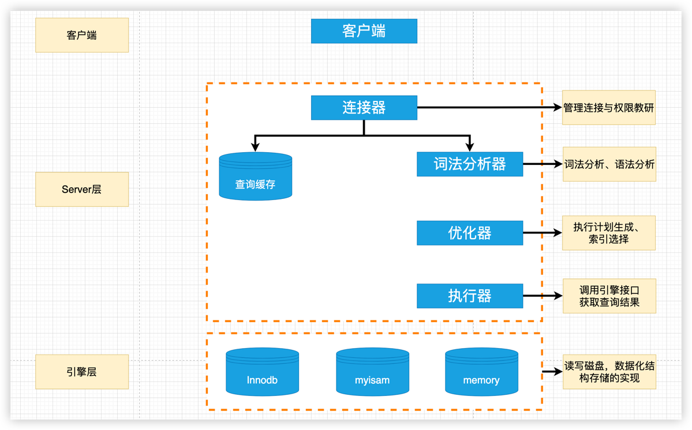

目录
=================

* [一条 SQL 在 MySQL 是如何执行的](#一条-sql-在-mysql-是如何执行的)
    * [查询缓存](#查询缓存)
    * [分析器](#分析器)
    * [优化器](#优化器)
    * [执行器](#执行器)


# 一条 SQL 在 MySQL 是如何执行的

当我们输入一条 select 语句：
## 查询缓存
1.Server 层并不会直接在词法分析器中执行，而是先去缓存中查找数据。(前提是我们把数据库的缓存打开了。在my.cnf 中配置)；
```text
my.cof
# query_cache_type 有 3个值：0代表关闭查询缓存 OFF， 1代表开启 ON 2(DEMAND)代表当sql语句中有 SQL_CACHE关键词时才缓存。
query_cache_type=2
配置完成后需要重启mysql
```
设置缓存后，只有当 sql 查询语句中携带 SQL_CACHE 显示指定，才会缓存。如：
```sql
select SQL_CACHE * from test where ID = 5
```
查看当前 mysql 是否开启缓存：
```shell
show global variables like "%query_cache_type%"
+------------------+--------+
| Variable_name    | Value  |
+------------------+--------+
| query_cache_type | DEMAND |
+------------------+--------+
可以看到已经设置成为了自定义缓存
```
监控缓存的命中率：
```shell
show status like "%Qcache%"
输出结果：
+-------------------------+---------+
| Variable_name           | Value   |
+-------------------------+---------+
| Qcache_free_blocks      | 1       |
| Qcache_free_memory      | 1031832 |
| Qcache_hits             | 0       |
| Qcache_inserts          | 0       |
| Qcache_lowmem_prunes    | 0       |
| Qcache_not_cached       | 437     |
| Qcache_queries_in_cache | 0       |
| Qcache_total_blocks     | 1       |
+-------------------------+---------+
Qcache_free_blocks:　    查询缓存（query cache）中可以使用的空闲的内存块
Qcache_free_memory:      查询缓存（query cache）可以使用的空闲的内存数。
Qcache_hits ：           查询缓存的命中数。
Qcache_inserts ：     被添加到查询缓存当中的查询的总数。
Qcache_lowmem_prunes：     由于内存太少而从查询缓存里删除的查询的总数。
Qcache_not_cached：     没有缓存的查询数量。包括不可缓存的，和由于query_cache_type的设置二不能缓存的。
Qcache_queries_in_cache：     注册在查询缓存里的查询数量。
Qcache_total_blocks：     在查询缓存中块的总数。
```
接下来测试一下缓存有没有生效：
```sql
select SQL_CACHE * from employees_explain where age=23;
运行上述语句之后，此时再次查看缓存：
+-------------------------+---------+
| Variable_name           | Value   |
+-------------------------+---------+
| Qcache_free_blocks      | 1       |
| Qcache_free_memory      | 1030232 |
| Qcache_hits             | 0       |
| Qcache_inserts          | 1       |
| Qcache_lowmem_prunes    | 0       |
| Qcache_not_cached       | 2       |
| Qcache_queries_in_cache | 1       |
| Qcache_total_blocks     | 4       |
+-------------------------+---------+
这个时候 Qcache_hits 的计数是 0，Qcache_inserts +1,当我们再次运行上述语句之后，再次查看：
+-------------------------+---------+
| Variable_name           | Value   |
+-------------------------+---------+
| Qcache_free_blocks      | 1       |
| Qcache_free_memory      | 1030232 |
| Qcache_hits             | 1       |
| Qcache_inserts          | 1       |
| Qcache_lowmem_prunes    | 0       |
| Qcache_not_cached       | 2       |
| Qcache_queries_in_cache | 1       |
| Qcache_total_blocks     | 4       |
+-------------------------+---------+
会发现 Qcache_hits +1
而这种查询缓存的弊端就是，当我们修改表中数据的时候，缓存就失效了，因此，查询缓存并不适用于变动比较频繁的表。
```
实际的应用场景中，往往只有静态表才会使用。静态表指的是哪些不经常改动的表，比如省市区这些编码的字典表，系统的配置表等等。这个时候
MySQL 的缓存才能起到它应有的作用。
## 分析器
如果没有命中查询缓存，就要开始执行查询语句了。
1. 首先分析器会对于语句进行"词法分析"：如：识别语句是什么类型。查询 select 或者 update 等；接着对语句进行进一步分析，比如识别表名，列名等；
2. 语法分析：词法分析完成之后，语法分析器会根据语法规则对输入的sql进行校验，语法是否符合MySQL语法。如果出错就会出现语法错误的提示。

推荐一个语法分析器的工具：idea 的插件：ANTLR v4

## 优化器
经过分析器之后，MySQL 明白需要做什么了。但是在真正执行语句之前，还需要经过优化器的处理。比如：当表中存在多个索引的时候，优化器会帮我们
决定使用那个索引；或者在一个语句有多表关联(join)的时候，决定各个表的连接顺序。

## 执行器
开始执行的时候，要先判断用户对表是否有操作权限，如果没有返回权限错误。如果有权限，则打开表继续执行，