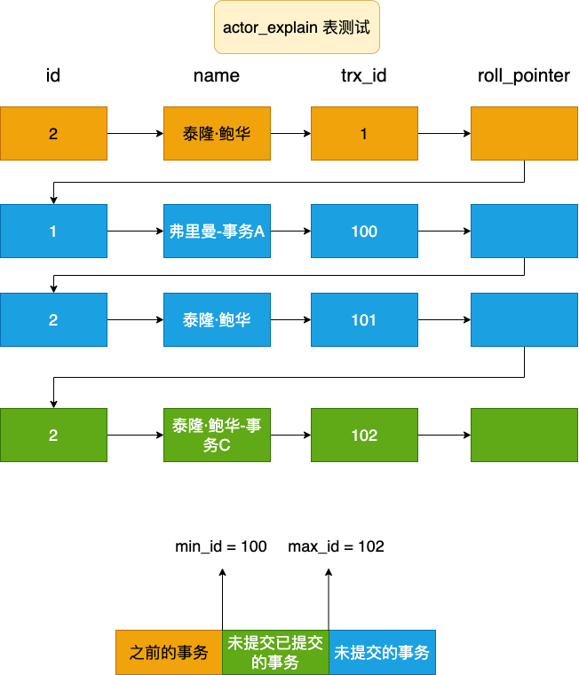
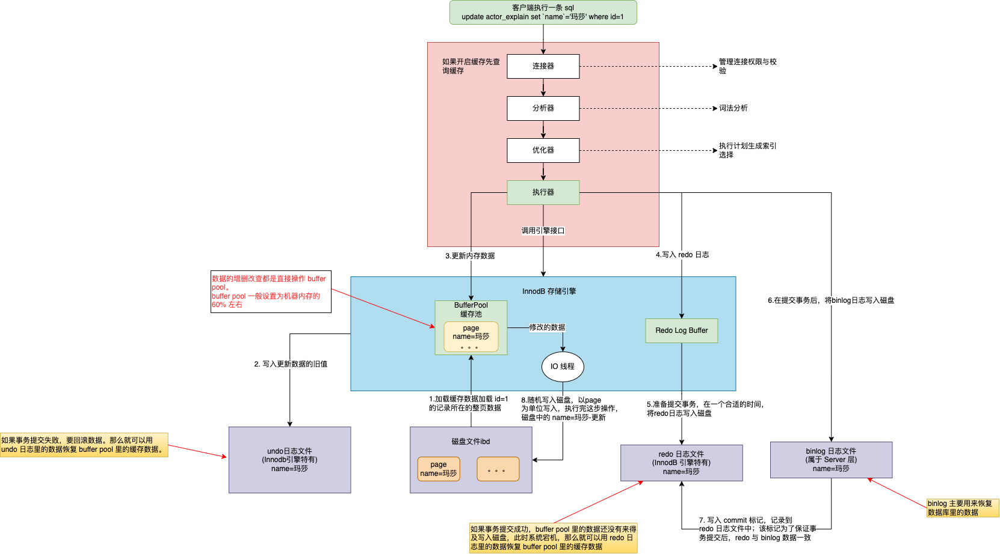

# MVCC 多版本并发控制机制
前面提到过，MySQL 是通过 MVCC(Multi-Version Concurrency Control) 来实现事务的隔离性的。通过这种机制避免了频繁加锁互斥，提高了 MySQL 读写的效率。
MySQL 事务在读已提交和可重复读隔离级别下实现了 MVCC 机制。

# undo 日志版本链与 read view 机制
在详细了解 MVCC 之前，先来看下 undo 日志版本链。

undo日志版本链是指一行数据被多个事务依次修改过后，在每个事务修改完后，Mysql 会保留修改前的数据 undo 回滚 日志，并且用两个隐藏字段 trx_id
和 roll_pointer 把这些 undo 日志串联起来形成一个历史记录版本链。通过 undo 日志可以回滚数据。

在可重复读的隔离级别：当事务开启，**执行查询** sql 的时候会生成当前事务的一致性视图 read-view。该视图在事务结束前都不会变化(如果是读已提交的
隔离级别，则每次查询都会重新生成视图)。这个视图由所有未提交事务 id 数组(数组中最小的 id 为 min_id)和已经创建的最大事务 id(max_id)组成。
事务里的任何 sql 查询结果需要从对应的版本链里的最新数据开始逐条与 read-view 做对比，从而得出最终的快照结果。

我们同时开起四个事务, 事务隔离级别为可重复读。
```sql
# 开启第一个事务A：
begin;
# 更新数据
update actor_explain set `name`='弗里曼-事务A' where id = 1;
# 开启第二个事务B：
begin;
# 更新数据
update actor_explain set `name`='玛莎-事务B' where id = 3;
# 开启第三个事务C：
begin;
# 更新数据
update actor_explain set `name` = '泰隆·鲍华-事务C' where id = 2;
# 提交此次事务
commit;
# 开启第四个事务D：
begin;
# 查询数据
select * from actor_explain where id=2;
```
来分析一下上面视图的过程：
1. 假设开启事务A，此时事务 id 为 100；开启事务B，此时事务 id 为 101，开启事务C，此时事务 id 为 102；此时开启事务
D，事务 id 为 103。 
2. 假设在事务 C 中更新数据之前，插入 id=2 的数据产生的事务 id 为 1；

此时事务 D 查询 sql 就会生成一个视图 read-view read-view[100, 101], 102


版本链的对比规则：
1. 如果 row 的 trx_id 落在橙色部分( trx_id<min_id )，表示这个版本是已提交的事务生成的，这个数据是可见的;
2. 如果 row 的 trx_id 落在蓝色部分( trx_id>max_id )，表示这个版本是由将来启动的事务生成的，是不可见的
3. 如果 row 的 trx_id 落在绿色部分，那就包括两种情况:
   1. 若 row 的 trx_id 在视图数组中(min_id <=trx_id<= max_id)，表示这个版本是由还没提交的事务生成的，不可见(若 row 的 trx_id 就是当前自
      己的事务，那么此时是可见的);
   2. 若 row 的 trx_id 不在视图数组中，表示这个版本是已经提交了的事务生成的，可见。(比如上面在事务C之前，开启事务插入数据，对于事务 C 可见)

因此在事务 C 提交了事务之后，事务 D 可以看到事务 C 修改的数据。 100<=102<=102，事务 C 此时的事务 id 102 不在 read-view 视图中，因此
可以看到事务 C 修改后的数据。

当我们我在事务A中修改数据：
```sql
update actor_explain set `name`='弗里曼-事务A第二次修改数据' where id = 1;
update actor_explain set `name`='弗里曼-事务A第三次次修改数据' where id = 1;

# 再次在事务D中查询数据：
select * from actor_explain where id=1;
+----+-----------+---------------------+
| id | name      | update_time         |
+----+-----------+---------------------+
|  1 | 弗里曼    | 2023-01-19 00:00:02 |
+----+-----------+---------------------+
```
发现数据并没有变更。分析一下：此时事务 A 的 id = 100，事务 D 的 read-view[100, 101], 此时 100<=100<=101, 由于事务 A 的 id 在 read-view
中，因此修改的数据不可见。会根据事务 A 的版本链一直查询到可见的事务 id 修改的那次数据。

此时我们将事务 A 提交，在事务 B 中作如下数据修改：
```sql
update actor_explain set `name`='玛莎-事务B第二次修改' where id = 1;
update actor_explain set `name`='玛莎-事务B第三次修改' where id = 1;

# 再次在事务 D 中查询数据：
select * from actor_explain where id=1;
+----+-----------+---------------------+
| id | name      | update_time         |
+----+-----------+---------------------+
|  1 | 弗里曼    | 2023-01-19 00:00:02 |
+----+-----------+---------------------+
发现查询到数据还是最开始的初始数据。
```
分析一下：此时事务 B 的事务 id 是 101，事务 A 的 id 是 100，即使 A 已经提交，但是对于我们的 read-view 来说，版本链是不会变化的，仍然是
[100,101], 所以事务 B 的事务 id 仍然在视图中，因此数据还是原来的初始数据。

可重复读的 read-view 在同一个事务中是不会改变，而读已提交的每次查询的 sql 都会改变视图 read-view，因此导致查询的结果也不同。
可以测试一下：同时开启 5 个事务，A，B，C，D，E；
```sql
# 事务 A 修改数据：
update actor_explain set `name`='弗里曼-事务A' where id = 1;
# 事务 B 修改数据：
update actor_explain set `name` = '泰隆·鲍华-事务B' where id = 2;
# 事务 C 修改数据，并提交
update actor_explain set `name`='玛莎事务C' where id = 3;
commit;
# 事务 D 查询数据：
select * from actor_explain where id=3;
+----+---------------+---------------------+
| id | name          | update_time         |
+----+---------------+---------------------+
|  3 | 玛莎事务C     | 2016-03-15 00:00:00 |
+----+---------------+---------------------+
# 事务 C 再次开启事务修改数据并提交：
update actor_explain set `name`='玛莎- 事务C第二次数据修改' where id = 3;
commit;
# 事务 D 查询数据：
select * from actor_explain where id=3;
+----+---------------+---------------------+
| id | name          | update_time         |
+----+---------------+---------------------+ 
|  3 | 玛莎事务C     | 2016-03-15 00:00:00 |
+----+---------------+---------------------+

# 事务 E 查询数据：
select * from actor_explain where id=3;
+----+--------------------------------------+---------------------+
| id | name                                 | update_time         |
+----+--------------------------------------+---------------------+
|  3 | 玛莎-事务CC第二次数据修改            | 2016-03-15 00:00:00 |
+----+--------------------------------------+---------------------+
# 可以看到不同的事务针对同一数据查询的结果是不相同的。因为事务 D 和事务 E 建立的 read-view 不同。
```

# BufferJoin 理解

 客户端发起一条修改数据的请求到 MySQL 的执行过程大致如上图。具体分析一下 MySQL Innodb 引擎执行这条指令的过程。
1. Innodb 收到更新的 sql 之后，首先会从磁盘文件中取出与 id=1 记录在同一页的所有数据，不会只取出 id=1 的一条数据。然后将这些数据放入
 Buffer Pool 缓存池中(MySQL 所有的增删改差都是在 Buffer Pool 缓存池中完成的)。
2. 然后 Innodb 引擎会将 id=1 这条数据的旧值记录到 undo 日志中，可以通过这个日志恢复 Buffer Pool 缓存中的数据，从而完成对磁盘中数据的回滚。
3. 接着开始更新内存中的数据，将 id=1 的这条数据的 name 的值修改成 "玛莎"。
4. 在更新内存数据的同时，将该操作放到 Redo Log Buffer 缓存中；
5. MySQL 会将内存中的 redo log 日志记录选择一个合适的时间写入磁盘中；
6. 在 redo log 提价事务处于准备状态中的时候，服务层 Server 会将提交的事务操作记录记录到 binlog 中；这个日志是 MySQL 所有引擎都实现的日志记录逻辑；
7. 在 binlog 写入磁盘之后，将 commit 标记同步到 redo log 日志中；保证事务提交之后，redo 与 binlog 数据一致；
8. 最终将内存中的数据随机写入磁盘中；

为什么Mysql不能直接更新磁盘上的数据而且设置这么一套复杂的机制来执行SQL了? 
因为来一个请求就直接对磁盘文件进行随机读写，然后更新磁盘文件里的数据性能可能相当差。因为磁盘随机读写的性能是非常差的，所以直接更新磁盘文
件是不能让数据库抗住很高并发的。 Mysql这套机制看起来复杂，但它可以保证每个更新请求都是更新内存BufferPool，然后顺序写日志文件，同时还能
保证各种异常情况下的数据一致性。 更新内存的性能是极高的，然后顺序写磁盘上的日志文件的性能也是非常高的，要远高于随机读写磁盘文件。 正是通
过这套机制，才能让我们的MySQL数据库在较高配置的机器上每秒可以抗下几干的读写请求。


