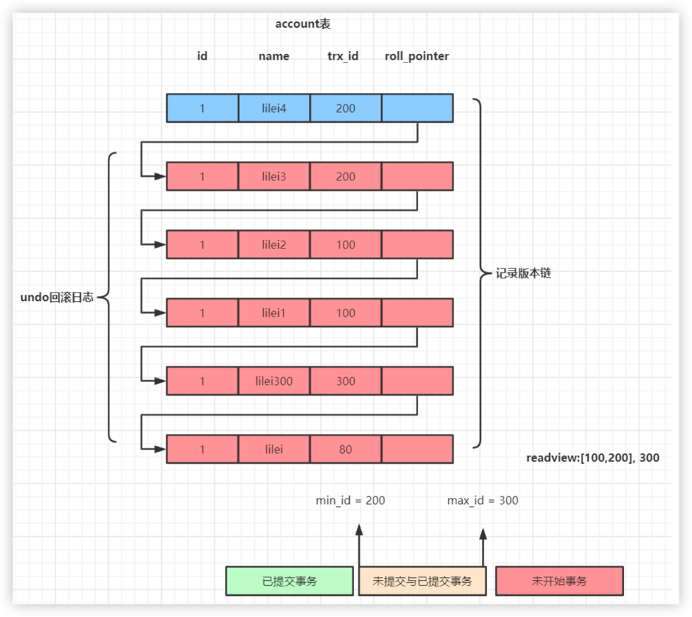

# MVCC 多版本并发控制机制
前面提到过，MySQL 是通过 MVCC(Multi-Version Concurrency Control) 来实现事务的隔离性的。通过这种机制避免了频繁加锁互斥，提高了 MySQL 读写的效率。
MySQL 事务在读已提交和可重复读隔离级别下实现了 MVCC 机制。

# undo 日志版本链与 read view 机制
在详细了解 MVCC 之前，先来看下 undo 日志版本链。

undo日志版本链是指一行数据被多个事务依次修改过后，在每个事务修改完后，Mysql 会保留修改前的数据 undo 回滚 日志，并且用两个隐藏字段 trx_id
和 roll_pointer 把这些 undo 日志串联起来形成一个历史记录版本链。
我们同时开起四个事务。
```sql

```